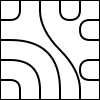

..
   Copyright 2023 Louis Paternault
   
   Cette œuvre de Louis Paternault est mise à disposition selon les termes de
   la licence Creative Commons Attribution - Partage dans les Mêmes Conditions
   4.0 International (CC-BY-SA). Le texte complet de la licence est disponible
   à l'adresse : http://creativecommons.org/licenses/by-sa/4.0/deed.fr

.. _truchet:

********************************************************
`truchet` — Génération de tuiles de Truchet généralisées
********************************************************

.. currentmodule:: jouets.truchet

.. contents::
   :local:
   :depth: 2

Introduction
============

J'ai commencé à jouer lors d'une réunion avec les `tuiles de Truchet <https://en.wikipedia.org/wiki/Truchet_tiles>`__.

.. image:: truchet/intro.png

Je me suis ensuite demandé ce qui arriverait si, au lieu de diviser une seule fois chaque côté de chaque tuile, nous les divisions deux, trois fois, ou plus. Voici *toutes* les tuiles qui peuvent alors être générées (avec un nombre fixé de sommets de départ, et des arêtes qui ne se croisent pas).

- Une section : deux tuiles différentes.

  .. image:: truchet/toutes2.png

- Deux sections : 14 tuiles différentes.

  .. image:: truchet/toutes4.png

- Trois sections : 132 tuiles différentes.

  .. image:: truchet/toutes6.png

Avant de continuer, nous pouvons remarquer que la forme carrée n'apporte rien (hormi le fait de pouvoir paver) : tout cela peut être étudié dans un cercle.

.. image:: truchet/equivalence.gif

Et cela est intéressant, car les tuiles à trois arêtes, par exemples, peuvent être représentées dans un cercle mais pas dans un carré (qui doit avoir un nombre d'arêtes pair).

Définition
==========

.. proof:definition:: Tuile de Truchet d'ordre :math:`n`

   Pour un nombre :math:`n` entier positif, nous appelons *tuile de Truchet d'ordre :math:`n`* le graphe :

   - à :math:`2n` sommets disposés en cercle ;
   - à :math:`n` arêtes reliant chacune deux sommets ;
   - tel que les arêtes :

     - ne « sortent » pas du cercle ;
     - ne se croisent pas.

Énumération de nombre de tuiles
===============================

En énumérant le nombre de tuiles de Truchet généralisées de manière expérimentale, nous obtenons les nombres suivants (en fonction du nombre d'arêtes) :

+------------------+---+---+---+---+----+----+-----+
| Nombre d'arêtes  | 0 | 1 | 2 | 3 |  4 |  5 |   6 |
+------------------+---+---+---+---+----+----+-----+
| Nombre de tuiles | 1 | 1 | 2 | 5 | 14 | 42 | 132 |
+------------------+---+---+---+---+----+----+-----+

Pouvons nous trouver l'expression d'une suite qui correspond à ce nombre de tuiles ?

Appelons :math:`t_n` le nombre de tuiles de Truchet d'ordre :math:`n` arêtes. Nous savons que :math:`t_0=1`. Pour calculer les autres valeurs de :math:`t`, prenons une tuile, et intéressons nous à un sommet de départ en particulier (le point supérieur dans notre exemple). Nous remarquons deux choses :

.. image:: truchet/recurrence.png

D'abord, qu'à partir de ce point de départ, il y a autant d'arêtes possibles que l'ordre de la tuile (5 dans notre exemple ; les arêtes en pointillés sont ignorées car elles ne permettent pas de tracer les arêtes restantes en respectant les conditions).

Ensuite, chacune de ces possibilités découpe le graphe en deux sous-graphes (en vert et bleu dans notre exemple) qui sont aussi des tuiles de Truchet d'ordre inférieur (les sommets ne sont alors pas disposés en cercle, mais c'est sans importante).

Nous obtenons donc la formule de récurrence suivante :

.. proof:property::

   Pour tout :math:`n` entier strictement positif, on a :

   .. math::

      t_{n+1} = \sum_{i=0}^n t_i\times t_{n-i}

Cette relation de récurrence correspond bien avec la liste obtenue expérimentalement plus haut.

Fantastique ! Cette suite de nombre est peut-être intéressante. Est-ce la découverte qui va me valoir une médaille Fields ? `Vérifions si cette suite est déjà connue… <https://oeis.org/A000108>`__

Fantastique ! Je fais partie des millions de personnes qui ont (re)découvert les `nombres de Catalan <https://fr.wikipedia.org/wiki/Nombre_de_Catalan>`__ …

Nombres de Catalan
==================

Le nombre de tuiles de Truchet d'ordre :math:`n` correspond donc au nombre de Catalan : :math:`C_n`.

Un parallèle peut être fait avec l'une des propriétés de cette suite : le nombre de Catalan :math:`C_n` correspond au nombre de manières dont :math:`n` paires de parenthèses peuvent être correctement assemblées : *((()))*, *()(()())*, mais pas *)(()*.

En effet, en découpant notre tuile, et en l'ouvrant, nous pouvons faire correspondre chaque arête à une paire de parenthèses, et faire ainsi une bijection entre le nombre de tuiles et le nombre d'assemblages de parenthèses.

   .. image:: truchet/parentheses.png

Génération
==========

Pour générer de manière informatique l'ensemble des tuiles de Truchet d'ordre :math:`n`, il faut d'abord définir une manière de les représentées. Nous utilisons une liste.

Par exemple, la tuile ci-dessous est représentée par la liste : ``t = [3, 1, -1, -3, 1, -1, 3, 1, -1, -3]``.

.. image:: truchet/representation.png

Les sommets sont pris dans le sens trigonométrique (numéros de 0 à 9 dans l'exemple), et les valeurs de la liste correspondent aux « sauts » à effectuer pour rejoindre l'extrémité de l'arête. Par exemple :

- ``t[0] == 3`` signifie que l'extrémité de l'arête partant du sommet :math:`0` est le sommet :math:`0+3=3` ;
- ``t[2] == -1`` signifie que l'extrémité de l'arête partant du sommet :math:`2` est le sommet :math:`2-1=1` ;
- etc.

Nous pouvons maintenant réutiliser le principe de la formule de récurrence énoncée plus haut pour générer l'ensemble des tuiles.

.. image:: truchet/recurrence.png

En partant d'une arête arbitraire, on coupe le graphe en deux (bleu et vert), et on énumère (de manière récursive) l'ensemble des sous-tuiles possibles dans chacun des deux côtés. L'ensemble des tuiles possibles est donc la combinaison de toutes les sous-tuiles possibles.

.. literalinclude:: ../jouets/truchet/__init__.py
   :language: python
   :linenos:
   :pyobject: tuiles

Pour générer le code `TikZ <https://ctan.org/pkg/tikz>`__ correspondant, il suffit d'un peu de calcul vectoriel, de coordonnées polaires, de proportionnalités, de trigonométrie, d'huile de coude, et le tour est joué !

Exemples
========

Un logiciel ``truchet``, ainsi que des *templates* (patrons) permet de générer des tuiles et de pavages avec différents paramètres. Utilisez ``truchet --help`` pour voir les options. Voici quelques exemples.

- Pavage carré, une section, régulier : ``truchet pavage-carre.tex --cotes 4  --sections 1 --taille 15x10 --tuiles liste6``

  .. image:: truchet/pavage-carre-1-regulier.png

- Pavage carré, une section, aléatoire : ``truchet pavage-carre.tex --cotes 4  --sections 1 --taille 15x10 --tuiles random --style="aretes=draw=black, line width=10" --style="pair="``

  .. image:: truchet/pavage-carre-1-aleatoire.png

- Pavage carré, deux sections, aléatoire : ``truchet pavage-carre.tex --cotes 4  --sections 2 --taille 15x10 --durete .6 --style="bord=" --style="pair=fill=blue" --style="impair=fill=pink" --tuiles random``

  .. image:: truchet/pavage-carre-2-aleatoire.png

- Pavage carré, trois sections, régulier : ``truchet pavage-carre.tex --cotes 4  --sections 3 --taille 15x10 --style="pair=fill=brown" --style="impair=fill=yellow" --style="bord=draw=black, very thick" --durete=.33 --tuiles liste6``

  .. image:: truchet/pavage-carre-3-regulier.png

- Pavage carré, trois sections, aléatoire : ``truchet pavage-carre.tex --cotes 4  --sections 3 --taille 15x10 --style="pair=" --style="impair=" --style="bord=" --durete=.33 --tuiles random``

  .. image:: truchet/pavage-carre-3-aleatoire.png

- Pavage hexagonal, deux sections, régulier : ``truchet pavage-hexagone.tex --cotes=6 --sections 2 --taille 15x10 --style="impair=fill=orange" --style="pair=fill=green" --tuiles=liste6 --durete=.5``

  .. image:: truchet/pavage-hexa-2-regulier.png

- Pavage hexagonal, deux sections, aléatoire : ``truchet pavage-hexagone.tex --cotes=6 --sections 2 --taille 15x10 --style="impair=fill=teal" --style="pair=fill=violet" --tuiles=random --durete=.45``

  .. image:: truchet/pavage-hexa-2-aleatoire.png

- Pavage hexagonal, trois sections, aléatoire : ``truchet pavage-hexagone.tex --cotes=6 --sections 3 --taille 15x10 --style="impair=fill=magenta" --style="pair=fill=lime" --tuiles=random --durete=.3``

  .. image:: truchet/pavage-hexa-3-aleatoire.png

- Pavage hexagonal, trois sections, aléatoire : ``truchet pavage-hexagone.tex --cotes=6 --sections 3 --taille 15x10 --style="impair=fill=cyan" --style="bord=" --style="pair=fill=orange" --tuiles=liste5 --durete=.3``

  .. image:: truchet/pavage-hexa-3-regulier.png

- Pavage triangulaire, deux sections, aléatoire : ``truchet pavage-triangle.tex --cotes=3 --sections 2 --taille 20x20 --style="impair=fill=brown"  --style="pair=fill=magenta" --tuiles=random --durete=.5``

  .. image:: truchet/pavage-triangle-2-aleatoire.png

- Pavage triangulaire, deux sections, régulier : ``truchet pavage-triangle.tex --cotes=3 --sections 2 --taille 20x20 --style="impair=fill=orange"  --style="pair=fill=blue"  --style="bord=" --tuiles=liste3 --durete=.5``

  .. image:: truchet/pavage-triangle-2-regulier.png

Pour aller plus loin
====================

Plusieurs améliorations sont envisageables.

Format de sortie
----------------

`« J'imagine qu'il est tentant, si le seul outil dont vous disposiez est un marteau, de tout considérer comme un clou. » <https://fr.wikipedia.org/wiki/Loi_de_l%27instrument>`__

Le paquet `TikZ <https://ctan.org/pkg/tikz>`__ est une merveille, et je sais l'utiliser, donc c'est avec lui que je génère les tuiles de Truchet ici, mais LaTeX n'a pas été conçu pour dessiner, donc la compilation est très longue. Si je devais recommencer ce projet à zéro, je préfèrerais comme langage de sortie le `SVG <https://fr.wikipedia.org/wiki/Scalable_Vector_Graphics>`__, qui ne permet pas de manipuler les coordonnées polaires ni de faire du calcul vectoriel (moins que TikZ en tout cas), mais qui devrait être plus adapté.

Courbes de Bézier
-----------------

Pour tracer ces tuiles, des `courbes de Bézier <https://fr.wikipedia.org/wiki/Courbe_de_Bézier>`__ sont utilisées, mais avec seulement deux points, aux deux extrémités. Si cela fonctionne pour des courbes simples, ou lorsque la tuile n'est pas trop encombrée, dés qu'il y a trop de courbes dans une tuile, il y a des risques de chevauchement.

.. image:: truchet/chevauche.png

En utilisant des courbes de Bézier avec plus de points, il devrait être possible d'avoir des courbes plus complexes, qui ne se chevauchent pas.

