<h1 align="center">Omni-Authify</h1>

---

    
    
    
    
    
    

---

**Omni-Authify** is a Python package that makes it easy to support OAuth2 authentication across multiple frameworks like Django, Django-DRF, Flask, and FastAPI.

## 📚 Table of Contents
- [Contributors](CONTRIBUTING.md)
- [Documentation](docs)
  - [Setup](docs/Setup)
  - [Supported Frameworks](docs/providers.md)

---

```mermaid
flowchart TD
    %% Value Proposition
    valueProposition["🚀 Save Your Time and Spend it with your Family
    <br/>⏱️ Integrate Multiple OAuth Providers in Minutes
    <br/>🔓 Secure, Standardized Social Login Solution"]

    %% System Requirements
    subgraph Requirements ["🔧 System Requirements"]
        python[" Python 3.8+
        🐍 Minimum Version"]
        pip[" pip 24.3.1+
        📦 Package Manager"]
        requests[" requests>=2.32.3
        🌐 HTTP Library"]
    end
    %% Providers Subgraph
    subgraph Providers ["🌍 OAuth2 Providers"]
        google[" Google 
        OAuth 2.0
        📦 Client ID/Secret"]
        facebook[" Facebook/Instagram 
        OAuth 2.0
        📦 Client ID/Secret
        🔒 Scope: email,public_profile"]
        twitter[" Twitter/X 
        OAuth 2.0
        📦 Client ID/Secret"]
        linkedin[" LinkedIn 
        OAuth 2.0
        📦 Client ID/Secret"]
        github[" GitHub 
        OAuth 2.0
        📦 Client ID/Secret"]
        apple[" Apple 
        OAuth 2.0
        📦 Client ID/Secret
        🔒 Sign in with Apple"]
        telegram[" Telegram 
        Bot Token
        🔑 API Token"]
    end
    %% Frameworks Subgraph
    subgraph Frameworks ["🧰 Supported Frameworks"]
        django[" Django 
        Version: 3+
        📦 pip install omni-authify[django]
        🔧 Django>=4.2, <=5.1.3"]
        djangoDRF[" Django-DRF 
        Version: 3.3+
        📦 pip install omni-authify[drf]
        🔧 DRF>=3.12.3, <=3.15.2"]
        fastapi[" FastAPI 
        Latest Version
        📦 pip install omni-authify[fastapi]
        🔧 fastapi>=0.115.0"]
        flask[" Flask 
        Latest Version
        📦 pip install omni-authify[flask]
        🔧 Flask>=3.0.0"]
    end
    %% Connections
    valueProposition --> Requirements
    Requirements --> Providers
    Providers --> Frameworks
    
    %% Styling
    classDef providerStyle fill:#f0f8ff,color:#003366,stroke:#6699cc,stroke-width:2px;
    classDef frameworkStyle fill:#e6f3e6,color:#004d00,stroke:#66a366,stroke-width:2px;
    classDef requirementsStyle fill:#fff0e6,color:#4d2600,stroke:#cc8533,stroke-width:2px;
    classDef valuePropositionStyle fill:#e6f2ff,color:#000080,stroke:#4169e1,stroke-width:3px,font-weight:bold;
    
    class google,facebook,twitter,linkedin,github,apple,telegram providerStyle;
    class django,djangoDRF,fastapi,flask frameworkStyle;
    class python,pip,requests requirementsStyle;
    class valueProposition valuePropositionStyle;
```

## 📄 Documentation

Omni-Authify has a detailed set of documentation files to guide you through setup, integration, and usage.

### 📊 Provider Documentation
- [Providers Overview](docs/providers.md)

### 📖 Setup Guides
- [Facebook Setup Guide](docs/Setup/facebook.md)
- [Google Setup Guide](docs/Setup/google.md)
- [Twitter Setup Guide](docs/Setup/twitter.md)
- [LinkedIn Setup Guide](docs/Setup/linkedin.md)
- [GitHub Setup Guide](docs/Setup/github.md)
- [Telegram Setup Guide](docs/Setup/telegram.md)

### 🛠️ Supported Frameworks
- [Django Setup Guide](docs/usage/django.md)
- [Django-DRF Setup Guide](docs/usage/django-drf.md)
- [FastAPI Setup Guide](docs/usage/fastapi.md)
- [Flask Setup Guide](docs/usage/flask.md)

### 🚀 Installation Instructions
- [Installation Guide](docs/installation.md)

---

## 👥 Contributors

We believe in the power of collaboration. Below are some of our amazing contributors:

| Name                                                | LinkedIn                                                             | Project Spent Time                                                                                                                       |
|-----------------------------------------------------|----------------------------------------------------------------------|------------------------------------------------------------------------------------------------------------------------------------------| 
| [Mukhsin Mukhtorov](https://github.com/Mukhsin0508) | [LinkedIn](https://www.linkedin.com/in/mukhsin-mukhtorov-58b26221b/) |  |

If you’d like to join this list, please see our [Contributing Guide](CONTRIBUTING.md) for details.

## 📜 License

This project is licensed under the MIT License. See the [LICENSE](./LICENSE) file for more information.

---

**Omni-Authify** makes adding OAuth2 authentication to your project effortless. Whether you are building with Django, DRF, FastAPI, or Flask, Omni-Authify provides you with a unified and easy approach to handle social logins. We are excited to see what you build with Omni-Authify! 🚀

