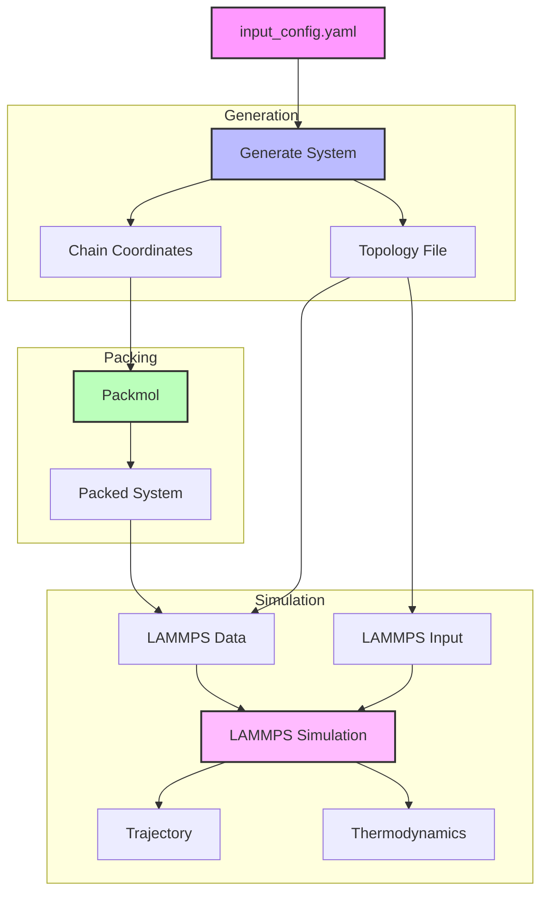
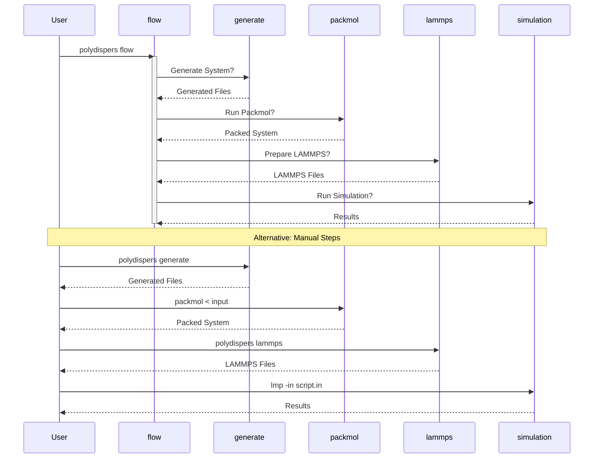

# Polydisperse LJ Polymer Generator

A tool for generating polydisperse polymer systems for LAMMPS simulations.

## Workflow

### Data Flow



### Command Flow



## Features

- Generate polymer systems with specified:
  - Number of chains
  - Number-average molecular weight (Mn)
  - Polydispersity index (PDI)
  - Box size
  - Bond length
  - Bead radius
- Support for different bead types (A-B polymers)
- Automatic LAMMPS input file generation
- Integration with Packmol for system packing

### Schulz-Zimm Distribution

The tool calculates the Schulz-Zimm distribution parameters based on the target chain length and PDI.

- k parameter: 1 / (PDI - 1)
- theta parameter: target chain length / (k + 1)

The tool prints the distribution statistics, including the mean chain length, PDI, and Schulz-Zimm parameters.

Example of the output


## Requirements

- Python 3.11+
- [Packmol](https://m3g.github.io/packmol/)
- [LAMMPS](https://www.lammps.org/) (any variant: lmp, lmp_serial, or lmp_mpi)

## Installation

1. Clone the repository:
```bash
git clone https://github.com/yourusername/polydispers-lj-generator.git
cd polydispers-lj-generator
```

2. Create and activate a virtual environment:
```bash
python -m venv .venv
source .venv/bin/activate  # On Unix/macOS
# or
.venv\Scripts\activate  # On Windows
```

3. Install the package:
```bash
pip install -e .
```

## Usage

### Configuration

Create an input configuration file (e.g., `input_config.yaml`):

```yaml
num_chains: 10
mn: 1000
pdi: 1.2
box_size: 100
output_dir: ./sys1
seed: 42
polymer:
  bond_length: 0.85
  bead_radius: 1.0
  repeat_unit_topology: AB
  bead_types:
    A:
      mass: 1.0
      type_id: 1
    B:
      mass: 1.0
      type_id: 2
```

### Commands

1. Generate polymer system:
```bash
polydispers generate --config input_config.yaml
```

2. Interactive workflow (recommended):
```bash
polydispers flow --config input_config.yaml
```
This will guide you through:
- System generation
- Packmol packing
- LAMMPS file preparation
- LAMMPS simulation

3. Prepare LAMMPS files separately:
```bash
polydispers lammps --topology-file topology.yaml --coordinates coordinates.xyz
```

## Output Files

The tool generates several files in the output directory:
- `topology.yaml`: System topology description
- `chain_*.xyz`: Individual chain coordinates
- `packmol_input.txt`: Packmol input script
- `lj.xyz`: Packed system coordinates (after running Packmol)
- `lj.data`: LAMMPS data file
- `lj.in`: LAMMPS input script
- `instructions.sh`: Shell script with next steps
- `thermo.dat`: LAMMPS thermodynamic output (after simulation)
- `traj.lammpstrj`: LAMMPS trajectory file (after simulation)

## LAMMPS Simulation Details

The generated LAMMPS input script includes:
- LJ potential with cutoff 2.5σ
- FENE bonds
- NPT equilibration with Berendsen thermostat
- NVT production run
- Trajectory and thermodynamic output

## Contributing

Contributions are welcome! Please feel free to submit a Pull Request.

## License

This project is licensed under the MIT License - see the LICENSE file for details.
