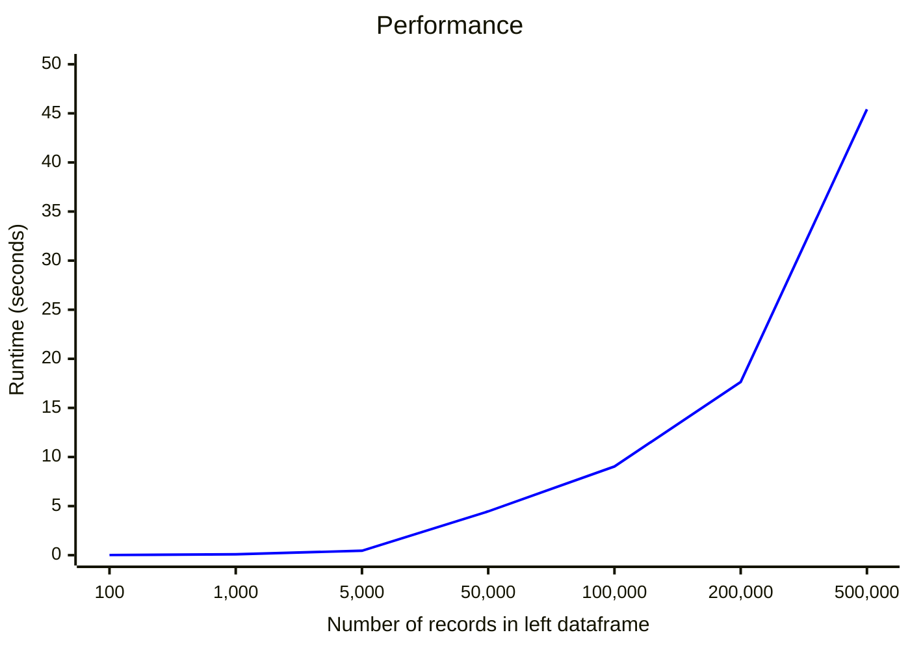

# Welcome to reconPy

ReconPy is a powerful yet user-friendly data reconciliation engine designed to compare records across two dataframes. Its key features include:

- **Flexibility**: Adaptable to various data structures and comparison needs.
- **Score-based Matching**: Utilizes a scoring system to determine the optimal matches between records.
- **One-to-One Matching**: Each record is matched only once, ensuring no duplication in the reconciliation process.
- **Deterministic Resolution**: In cases of multiple optimal matches, it consistently selects the first occurrence.

### Primary Applications  

While ReconPy is versatile enough for use across various industries, it's particularly well-suited for financial sector applications, including: **asset management firms**, **banks**, **brokers-dealers** and **hedge funds**.

### Common Use Cases in Finance

- Front Office/Back Office (FOBO) Reconciliation
- Trade Reconciliation
- Position Reconciliation
- Cash Activity Reconciliation
- Cash Balance Reconciliation

ReconPy streamlines these critical financial processes, enhancing accuracy and efficiency in data comparison and validation tasks.

## The Function

> output = reconPy.recon(**left_df**, **right_df**,  **left_exact_match_cols**, **right_exact_match_cols**, **left_compare_cols**, **right_compare_cols**, **show_left_cols**=[], **show_right_cols**=[], **weight**=None, **tolerance_percentage**=None, **suffix**=['_left', '_right'], **show_matching_status**=True, **show_matching_score**=False)

## The Parameters

**left_df**:  _DataFrame_  
The primary DataFrame for comparison.

**right_df**:  _DataFrame_  
The secondary DataFrame for comparison.

**left_exact_match_cols**:  _list of string_  
Columns from left_df used for exact matching. These columns join left_df and right_df, requiring identical values.

**right_exact_match_cols**:  _list of string_  
Columns from right_df used for exact matching. These columns join left_df and right_df, requiring identical values.

> [!NOTE]
> The order of left_exact_match_cols and right_exact_match_cols is crucial. They link corresponding columns when header names differ between left_df and right_df:
>
> Correct example:  
> left_exact_match_cols = ['Trade date', 'Settlement date', 'Stock code']  
> right_exact_match_cols = ['TD', 'SD', 'Bloomberg code']
>
> Incorrect example:  
> _'Trade date' incorrectly linked to 'Bloomberg code'_  
> left_exact_match_cols = ['Trade date', 'Settlement date', 'Stock code']  
> right_exact_match_cols = ['Bloomberg code', 'SD', 'TD']

**left_compare_cols**:  _list of string_  
Columns from left_df used to calculate matching scores and determine if record pairs are within matching tolerance. Supports float, integer, date, datetime, and string data types. String comparisons will have blank diff columns.

**right_compare_cols**:  _list of string_  
Columns from right_df used to calculate matching scores and determine if record pairs are within matching tolerance. Supports float, integer, date, datetime, and string data types. String comparisons will have blank diff columns.

> [!NOTE]
> The order of left_compare_cols and right_compare_cols is crucial. They link corresponding columns when header names differ between left_df and right_df:  
>
> Example:  
> left_compare_cols = ['Quantity', 'Gross amount', 'Settlement amount']  
> right_compare_cols = ['Qty', 'Gross', 'Net']

**show_left_cols**:  _list of string, default =_  `[]`  
Left_df columns to display in the output. Leave empty to omit all left_df headers.

**show_right_cols**:  _list of string, default =_  `[]`  
Right_df columns to display in the output. Leave empty to omit all right_df headers.

**weight**:  _list of string, default =_  `[1/len(left_compare_cols)] * len(left_compare_cols)`  
Weights applied when calculating matching scores. Must be positive numbers summing to 1. Length should match left_compare_cols. Default applies equal weights.

> Example: For left_compare_cols = ['Quantity', 'Gross amount', 'Settlement amount'], weight = [0.7, 0.2, 0.1] means Quantity's score is multiplied by 0.7, Gross amount by 0.2, etc.

**tolerance_percentage**:  _list of string, default =_  `[0] * len(left_compare_cols)`  
Defines acceptable percentage difference for each compared column. Values must be greater than or equal to zero. Length should match left_compare_cols. Default is zero tolerance.

For date/datetime objects, 1% tolerance equals 3.6525 days. See  _Matching score calculation_  >  _Date/ datetime comparison_  for details.

> Example: tolerance_percentage = [7, 8, 9.15] means pairs won't match if the percentage difference exceeds 7%, 8%, and 9.15% for the first, second, and third compared columns respectively.

> [!NOTE]
> The lengths of left_compare_cols, right_compare_cols, weight, and tolerance_percentage must be identical.

**suffix**:  _list of string, default =_  `['_left', '_right']`  
Suffixes appended to left_compare_cols and right_compare_cols. Must be a list of two strings.

**show_matching_status**:  _bool, default =_  `True`  
If True, displays matching status in _matching_status_ in the output dataframe. Possible statuses:
 *Matched: Perfect match (zero tolerance)

- Matched with tolerance: Matched within specified tolerance_percentage
- Unmatched: No possible match found

**show_matching_score**:  _bool, default =_  `False`  
If True, displays matching score of the matched record in _matching_score_ in the output dataframe.

## Installing reconPy

```python
>>> py -m pip install reconPy
```

## Usage

```python
>>> import reconPy
```

### Example 1 - trade reconciliation

This example demonstrates the reconciliation of broker's trade confirmation against OMS trade reports, a routine task in financial institutions. The goal is to ensure that trades booked in the OMS align with broker trade confirmations by comparing multiple fields such as trade date, settlement date, security details, price, quantity, commission, market charges, and settlement amount.

In this scenario, while both dataframes refer to the same trade records, they differ in headers, values, formatting, and order.

---

df1 - JPM trade confirmation:

| JPM ID | Trade date | Settlement date | Client direction | BBG Code | ISIN         | CUSIP     | Gross Price | Executed quantity | Currency | Commission | Market charges | Gross amount | Settlement amount | Flow Type |
| ------ | ---------- | --------------- | ---------------- | -------- | ------------ | --------- | ----------- | ----------------- | -------- | ---------- | -------------- | ------------ | ----------------- | --------- |
| JPM_1  | 10-Oct-24  | 12-Oct-24       | Buy              | MSFT US  | US5949181045 | 594918104 | 440.37      | 8,500.00          | USD      | 425.00     | 12.00          | 3,743,145.00 | 3,743,582.00      | Algo      |
| JPM_2  | 10-Oct-24  | 12-Oct-24       | Sell             | TSLA US  | US88160R1014 | 88160R101 | 249.23      | 5,980.00          | USD      | 299.00     | 10.00          | 1,490,395.40 | 1,490,086.40      | DMA       |
| JPM_3  | 10-Oct-24  | 12-Oct-24       | Short Sell       | TSLA US  | US88160R1014 | 88160R101 | 249.23      | 4,650.00          | USD      | 930.00     | 8.00           | 1,158,919.50 | 1,157,981.50      | Voice     |
| JPM_4  | 10-Oct-24  | 12-Oct-24       | Buy              | MSFT US  | US5949181045 | 594918104 | 440.00      | 8,500.00          | USD      | 425.00     | 12.00          | 3,740,000.00 | 3,740,437.00      | Algo      |
| JPM_5 | 10-Oct-24  | 12-Oct-24       | Buy              | MSFT US  | US5949181045 | 594918104 | 441.00      | 8,500.00          | USD      | 425.00     | 12.00          | 3,748,500.00 | 3,748,937.00      | Algo      |

df2 - Internal OMS trade report:

| TD         | SD         | B/S        | Stock code | Avg price  | Net Price  | Qty   | Comm   | Total charges | Gross        | Net          | Ccy | Internal reference |
| ---------- | ---------- | ---------- | ---------- | ---------- | ---------- | ----- | ------ | ------------- | ------------ | ------------ | --- | ------------------ |
| 2024-10-10 | 2024-10-12 | Short Sell | TSLA US    | 249.230000 | 249.023978 | 4,650 | 950.00 | 8.00          | 1,158,919.50 | 1,157,961.50 | USD | INTERNAL_1         |
| 2024-10-10 | 2024-10-12 | Sell       | TSLA US    | 249.230000 | 249.169799 | 5,980 | 350.00 | 10.00         | 1,490,395.40 | 1,490,035.40 | USD | INTERNAL_2         |
| 2024-10-10 | 2024-10-12 | Buy        | MSFT US    | 440.000000 | 440.051412 | 8,500 | 425.00 | 12.00         | 3,740,000.00 | 3,740,437.00 | USD | INTERNAL_3         |
| 2024-10-10 | 2024-10-12 | Buy        | MSFT US    | 440.370000 | 440.421412 | 8,500 | 425.00 | 12.00         | 3,743,145.00 | 3,743,582.00 | USD | INTERNAL_4         |
| 2024-10-10 | 2024-10-12 | Buy        | MSFT US    | 441.000000 | 441.051412 | 8,500 | 425.00 | 12.00         | 3,748,500.00 | 3,748,937.00 | USD | INTERNAL_5         |

---

```python
>>> df1 = pd.read_excel('JPM_Trade_Confo_20241010.xlsx')
>>> df2 = pd.read_excel('OMS_20241010.xlsx')
>>> output = recon(left_df=df1, 
   right_df=df2, 
   show_left_cols=['Trade date','Client direction','BBG Code','JPM ID'], 
   show_right_cols=['Internal reference'], 
   left_exact_match_cols=['Trade date','Client direction','BBG Code','Currency'], 
   right_exact_match_cols=['TD','B/S','Stock code','Ccy'], 
   left_compare_cols=['Gross Price','Executed quantity','Commission','Market charges','Settlement amount'], 
   right_compare_cols=['Avg price','Qty','Comm','Total charges','Net'], 
   weight=[0.1,0.5,0.1,0.1,0.2],
   tolerance_percentage=[1,1,20,20,1],
   suffix=['_JPM','_OMS'])
>>> print(output)
```

Output:

| Trade date | Client direction | BBG Code | JPM ID | Internal reference | Gross Price_JPM | Avg price_OMS | Gross Price_diff | Executed quantity_JPM | Qty_OMS  | Executed quantity_diff | Commission_JPM | Comm_OMS | Commission_diff | Market charges_JPM | Total charges_OMS | Market charges_diff | Settlement amount_JPM | Net_OMS      | Settlement amount_diff | matching_status          |
| ---------- | ---------------- | -------- | ------ | ------------------ | --------------- | ------------- | ---------------- | --------------------- | -------- | ---------------------- | -------------- | -------- | --------------- | ------------------ | ----------------- | ------------------- | --------------------- | ------------ | ---------------------- | ------------------------ |
| 10/10/2024 | Buy              | MSFT US  | JPM_1  | INTERNAL_4         | 440.370         | 440.370       | 0                | 8,500.00              | 8,500.00 | 0                      | 425.00         | 425.00   | 0.00            | 12.00              | 12.00             | 0.00                | 3,743,582.00          | 3,743,582.00 | 0                      | Matched                  |
| 10/10/2024 | Buy              | MSFT US  | JPM_4  | INTERNAL_3         | 440.000         | 440.000       | 0                | 8,500.00              | 8,500.00 | 0                      | 425.00         | 425.00   | 0.00            | 12.00              | 12.00             | 0.00                | 3,740,437.00          | 3,740,437.00 | 0                      | Matched                  |
| 10/10/2024 | Buy              | MSFT US  | JPM_5  | INTERNAL_5         | 441.000         | 441.000       | 0                | 8,500.00              | 8,500.00 | 0                      | 425.00         | 425.00   | 0.00            | 12.00              | 12.00             | 0.00                | 3,748,937.00          | 3,748,937.00 | 0                      | Matched                  |
| 10/10/2024 | Short Sell       | TSLA US  | JPM_3  | INTERNAL_1         | 249.230         | 249.230       | 0                | 4,650.00              | 4,650.00 | 0                      |<mark>930.00</mark>         |<mark>950.00</mark>   |<mark>\-20.00</mark>         | 8.00               | 8.00              | 0.00                |<mark>1,157,982.00</mark>          |<mark>1,157,962.00</mark> |<mark>20</mark>                     |<mark>Matched within tolerance</mark> |
| 10/10/2024 | Sell             | TSLA US  | JPM_2  | INTERNAL_2         | 249.230         | 249.230       | 0                | 5,980.00              | 5,980.00 | 0                      |<mark>299.00</mark>         |<mark>350.00</mark>   |<mark>\-51.00</mark>         | 10.00              | 10.00             | 0.00                |<mark>1,490,086.00</mark>          |<mark>1,490,035.00</mark> |<mark>51</mark>                     |<mark>Matched within tolerance</mark> |

The program paired the records and detected small differences in commission, as shown in the  _Commission_diff_  column. Also in the matching_status column, those records are marked as "Matched within tolerance".

### Example 2 - MIS Report Reconciliation

This example involves reconciling monthly commission payments from two MIS reports. It's common to have discrepancies between reports from different systems, and reconciliation is crucial to understand the source of these discrepancies.

As the reports are exported from different systems, they have different columns and slightly different broker names:

> `JP Morgan Sec plc`

> `J.P. Morgan Securities plc.`

---

df1 - Monthly_Commission_Paid_2024Q1.xlsx:

| Broker entity name          | Month  | USD brokerage expenses |
| --------------------------- | ------ | ---------------------- |
| JP Morgan Sec               | 202401 | 54,772.00              |
| JP Morgan Sec               | 202402 | 87,377.00              |
| Merrill Lynch international | 202401 | 638,131.00             |
| Merrill Lynch international | 202402 | 659,135.00             |
| UBS Securities              | 202401 | 876,369.00             |
| UBS Securities              | 202402 | 574,978.00             |

df2 - Brokerage_Expenses_2024Q1.xlsx:

| Period | Broker long name            | Total commission paid (USD) |
| ------ | --------------------------- | --------------------------- |
| 202401 | J.P. Morgan Securities plc  | 54,681.00                   |
| 202401 | UBS Securities plc          | 876,341.00                  |
| 202401 | Merrill Lynch international | 637,898.00                  |
| 202402 | J.P. Morgan Securities plc  | 87,153.00                   |
| 202402 | UBS Securities plc          | 574,873.00                  |
| 202402 | Merrill Lynch international | 658,741.00                  |

---

```python
>>> df1 = pd.read_excel('Monthly_Commission_Paid_2024Q1.xlsx')
>>> df2 = pd.read_excel('Brokerage_Expenses_2024Q1.xlsx')
>>> output_2 = recon(left_df=df1,
   right_df=df2,
   show_left_cols=[],
   show_right_cols=['Period'],
   left_exact_match_cols=['Month'],
   right_exact_match_cols=['Period'],
   left_compare_cols=['Broker entity name','USD brokerage expenses'],
   right_compare_cols=['Broker long name','Total commission paid (USD)'],
   tolerance_percentage=[50,5])
>>> print(output_2)
```

The commission paid from the same brokers (but with different names on two reports) are paired up, and at the same time, the commission amounts are slightly off, as shown in the _USD brokerage expenses_diff_ column.

output_2:

String comparisons is expected to have blank diff columns.

| Period | Broker entity name_left     | Broker long name_right      | Broker entity name_diff | USD brokerage expenses_left | Total commission paid (USD)_right | USD brokerage expenses_diff | matching_status          |
| ------ | --------------------------- | --------------------------- | ----------------------- | --------------------------- | --------------------------------- | --------------------------- | ------------------------ |
| 202401 | Merrill Lynch international | Merrill Lynch international |                         |<mark>638,131</mark>                     |<mark>637,898</mark>                           |<mark>233</mark>                         |<mark>Matched within tolerance</mark> |
| 202402 | Merrill Lynch international | Merrill Lynch international |                         |<mark>659,135</mark>                     |<mark>658,741</mark>                           |<mark>394</mark>                         |<mark>Matched within tolerance</mark> |
| 202401 |<mark>UBS Securities</mark>              |<mark>UBS Securities plc</mark>          |                         |<mark>876,369</mark>                     |<mark>876,341</mark>                           |<mark>28</mark>                          |<mark>Matched within tolerance</mark> |
| 202402 |<mark>UBS Securities</mark>              |<mark>UBS Securities plc</mark>          |                         |<mark>574,978</mark>                     |<mark>574,873</mark>                           |<mark>105</mark>                         |<mark>Matched within tolerance</mark> |
| 202401 |<mark>JP Morgan Sec</mark>               |<mark>J.P. Morgan Securities plc</mark>  |                         |<mark>54,772</mark>                      |<mark>54,681</mark>                            |<mark>91</mark>                          |<mark>Matched within tolerance</mark> |
| 202402 |<mark>JP Morgan Sec</mark>              |<mark>J.P. Morgan Securities plc</mark>  |                         |<mark>87,377</mark>                      |<mark>87,153</mark>                            |<mark>224</mark>                         |<mark>Matched within tolerance</mark> |

## Matching Score Calculation

The matching score quantifies the difference or dissimilarity between values in the compared columns. A lower score indicates that the values being compared are more similar or alike. A matching score of 0 would indicate perfect similarity or an exact match.

$$
Optimal\ solution = \min(Matching\ score, \forall_{Tolerance} \in  \{1, \ldots, n\} )
$$

### Numeric Comparison

The matching score is measured using the square of the relative change. To avoid #div/0 error, 0.00000001 is added to the divisor.

$$
Tolerance_{n} \ge \frac{\left| number_{n}^{left} - number_{n}^{right} \right|}{number_{n}^{right}+  0.00000001} \times 100
$$

$$
Matching\ score_{n}=(\frac{number_{n}^{left} - number_{n}^{right}}{number_{n}^{right} +  0.00000001})^{2}
$$

### Date/ Datetime Comparison

The date score is measured as the difference between two dates relative to the number of days in a year. Considering leap years, the average number of days in a year is 365.25.

When the tolerance is 1%, the tolerance is 3.6525 days.

$$
Tolerance_{n} \ge \frac{\left|date_{n}^{left} - date_{n}^{right}\right|}{365.25} \times 100
$$

$$
Matching\ score_{n}=(\frac{ date_{n}^{left} - date_{n}^{right}}{365.25})^{2}
$$

### String Comparison

The string comparison is measured using the ratio function from [fuzzywuzzy library](https://pypi.org/project/fuzzywuzzy/).

$$
Tolerance_{n} \ge 100 - \mathrm{fuzz.ratio}({ string_{n}^{left}, string_{n}^{right}})
$$

$$
Matchzng\ score_{n}=(100 - \mathrm{fuzz.ratio}({ string_{n}^{left}, string_{n}^{right}}))^{2}
$$

## Performance



<details>
<summary>Show numbers in table</summary>

| Number of records | Run time (seconds) |
| ----------------------------- | ------------------ |
| 100                           | 0.0159             |
| 1,000                         | 0.0931             |
| 5,000                         | 0.4484             |
| 50,000                        | 4.4604             |
| 100,000                       | 9.0372             |
| 200,000                       | 17.641             |
| 500,000                       | 45.418             |

</details>

The dataset size is determined by the number of rows in the left dataframe. The reported execution time is calculated as the mean duration across 5 separate runs. The specific test parameters are as follows:

- Number of columns used for exact matching: 5
- Number of columns used for comparison: 6 (floats)
- Weighting: Equal weights
- Tolerance level: 0%
