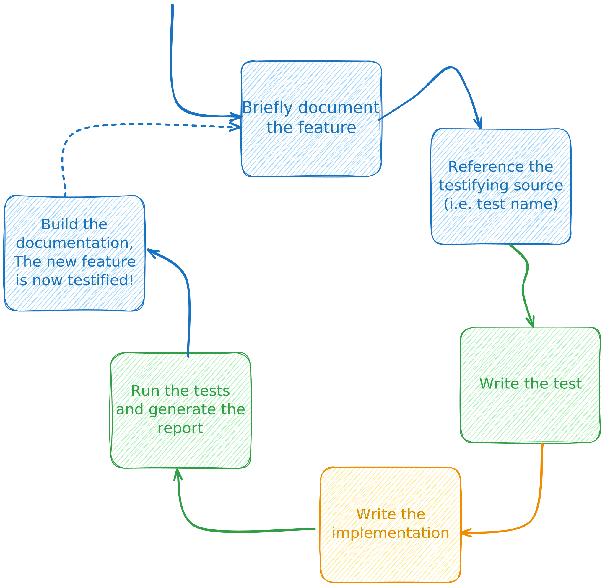

.. _testified-documentation:

Testified Documentation
#######################

**Testified Documentation** is a very simple idea.
It was born out of desire to create systems with living documentation, as
described by Gojko Adzic in his book
`"Specification by Example" <https://gojko.net/books/specification-by-example/>`_.

In a *technical* nutshell, Testified Documentation is a documentation
that references tests outcomes.

Think of documentation written with reStructuredText, Markdown, Asciidoc or
any other docs-as-code alternative. Imagine that everything you say in the documentation,
basically every paragraph references some tests outcomes that testify the narrative.
These references are verified during documentation compilation.
If the tests have failed, the documentation build also fails.

For example:

.. code-block:: rst

   System access
   =============

   Only a user with valid credentials: a username and a password can access
   the system. If credentials are wrong, the system returns "Authentication failed"
   error message.

   .. testify::
      test_a_user_can_access_system_with_username_and_password
      test_system_returns_authentication_failed_error_when_username_is_not_found
      test_system_returns_authentication_failed_error_when_password_is_wrong

We may reference the tests outcomes from a widespread JUnit XML -formatted report.
And if they are failed or missing... you get the idea :)

Living Documentation
====================

The technical aspects of Testified Documentation are fairly simple to implement
for any documentation-as-code system. But while living documentation implies
that the documentation was born out of up-to-date and tested
*executable specification*, the vise-verse is not necessary true.

What I mean is that executable specification does not magically transform into
*documentation*. Because documentation is not just the bare specification.
A good documentation is a narrative, a novel about the product.
It contains instructions, examples and practices,
explains design decisions and usage pitfalls,
it has API reference, it has CHANGELOG, it has ...

I've seen fantastic libraries which have next to zero test coverage, but a very
comprehensive and well-written documentation.
I also witnessed product features emerging after hours of specification honing,
but barely mentioning the resulting changes anywhere.
Let's try combining these two states!
We can start by building sharing understanding, and putting down key examples.
The next step by Gojko Adzic is automating verification - building tests
and implementing until they pass - a TDD cycle.

What if we instead take a small piece of specification that has not been
implemented;
briefly document it in reader-friendly language;
reference a yet non-existing automated test that testifies i.e. verifies
what we have just written;
create the test;
write the code;
run the build for all the pieces: code, tests, documentation.
And voilà! We've got ourselves a truly living documentation.
Rinse and repeat, until the specification is fully documented and testified.

Why not ...?
============

Cucumber
--------

Over the years of using cucumber, I failed to have
a living documentation as an outcome.
Cucumber is a fantastic tool for collaboration and building shared understanding
from examples. It's a miracle what a group of business people, developers,
QA, designers and all the involved parties can produce, when using techniques like
Example mapping, or User story mapping and cementing the examples as Cucumber
scenarios.
We can sure produce a *living specification* out of those,
but the result is not living documentation (at least not in my opinion.)

In case, you are using Cucumber solely for behavior tests, please read the
article by the author of Cucumber Aslak Hellesøy -
`The world's most misunderstood collaboration tool
<https://cucumber.io/blog/collaboration/the-worlds-most-misunderstood-collaboration-tool/>`_.

..

  When Matt Wynne and I published a book about Cucumber in 2011 it ended up
  on the radar of larger organisations that employ dedicated testers.
  These are people who are used to manual testing, enterprise tools such
  as HP Quality Center / ALM and to some degree other open source automation
  tools like Selenium.

  This crowd has pretty much fallen into the same trap as the Rails developers
  - they use Cucumber uniquely as a testing tool. No collaboration. No outside-in.

Doctest
-------

Doctest (as in
`Sphinx Doctest extension
<https://www.sphinx-doc.org/en/master/usage/extensions/doctest.html>`_) is a
way to embed and most importantly test code snippets in documentation.
Doctest is extremely handy when you want to ensure that the snippets in
documentation are up-to-date and aligned with the library code.

However, doctest and any similar snippet-testing system are not a
testing framework. They are often bound to a single programming language,
like Sphinx doctest - is Python-only. Sphinx doctest also lacks a comprehensive
assertion language. All you can do is compare the printed output of the snippet
code to an expected string.

But don't get me wrong, doctest is a great tool, and
Testified documentation and doctest can and should complement each-other in a rich
documentation full of usage examples.
